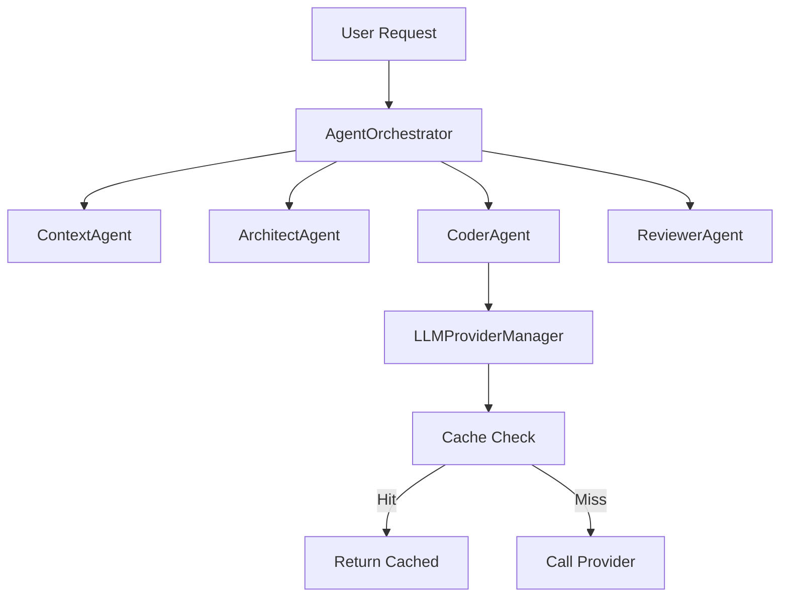

# Story 10.3: Create Comprehensive Architecture Documentation for Contributors

Status: done

<!-- Note: Validation is optional. Run validate-create-story for quality check before dev-story. -->

## Story

As a potential contributor,
I want detailed architecture documentation explaining system design,
So that I can understand the codebase and contribute effectively.

## Acceptance Criteria

1. **Given** Codebase is developed
2. **When** I read architecture documentation
3. **Then** Documentation explains: Orchestrator Central Pattern, Dual State Pattern, Hybrid Cache
4. **And** Documentation includes architecture diagrams (system, sequence, component)
5. **And** Documentation explains module boundaries and responsibilities
6. **And** Documentation details communication patterns (postMessage, events)
7. **And** Documentation includes data flow diagrams for key operations
8. **And** Documentation explains testing strategy and required coverage (>70%)
9. **And** Documentation lists key architectural decisions and rationale (ADRs)
10. **And** Documentation includes contribution guidelines (setup, PR process, code style)
11. **And** Documentation explains development workflow (build, debug, test)
12. **And** Architecture docs maintained in `/docs/architecture/` directory
13. **And** Architecture docs versioned with code (updated on structural changes)
14. **And** Unit tests not required for documentation (manual review process)

## Tasks / Subtasks

- [x] **Task 1: Create Architecture Directory Structure** (AC: #12)
  - [x] Create `docs/architecture/` directory
  - [x] Create `docs/architecture/index.md` as main entry point
  - [x] Create `docs/architecture/diagrams/` for Mermaid/SVG diagrams
  - [x] Create `docs/architecture/adr/` for Architecture Decision Records

- [x] **Task 2: Document Core Architectural Patterns** (AC: #3)
  - [x] Create `docs/architecture/patterns/orchestrator-central.md`:
    - AgentOrchestrator class responsibilities
    - Agent coordination flow: Context → Architect → Coder → Reviewer
    - State management during orchestration
    - Event emission via LifecycleEventManager
    - Code examples from `src/agents/orchestrator.ts`
  - [x] Create `docs/architecture/patterns/dual-state.md`:
    - Backend source of truth (ExtensionStateManager)
    - Frontend synchronized copy (WebviewStateManager)
    - postMessage communication protocol
    - State synchronization timing and guarantees
    - Code examples from `src/state/` and `src/webview/`
  - [x] Create `docs/architecture/patterns/hybrid-cache.md`:
    - Two-tier caching: L1 Memory (LRU) + L2 File System
    - Cache key generation and invalidation
    - TTL configuration and eviction policies
    - >50% hit rate target metrics
    - Code examples from `src/llm/cache/`

- [x] **Task 3: Create Architecture Diagrams** (AC: #4, #7)
  - [x] Create `docs/architecture/diagrams/system-overview.md`:
    - High-level system diagram with main components
    - VSCode Extension ↔ Webview communication layer
    - LLM Provider integration points
  - [x] Create `docs/architecture/diagrams/component-diagram.md`:
    - Module dependencies visualization
    - Key services and their relationships
    - Use Mermaid diagram format for versioning
  - [x] Create `docs/architecture/diagrams/sequence-diagrams.md`:
    - User request processing flow
    - Agent collaboration sequence
    - Suggestion accept/reject flow
    - Error handling flow
  - [x] Create `docs/architecture/diagrams/data-flow.md`:
    - LLM request → cache check → response flow
    - State update propagation flow
    - Telemetry data flow (opt-in)

- [x] **Task 4: Document Module Boundaries** (AC: #5)
  - [x] Create `docs/architecture/modules/overview.md`:
    - Summary of all modules and their purpose
    - Module dependency rules
  - [x] Create `docs/architecture/modules/agents.md`:
    - `src/agents/` module responsibilities
    - IAgent interface and implementations
    - Orchestrator coordination
  - [x] Create `docs/architecture/modules/llm.md`:
    - `src/llm/` module responsibilities
    - ILLMProvider interface and adapters
    - LLMProviderManager and registry
    - Caching subsystem
  - [x] Create `docs/architecture/modules/state.md`:
    - `src/state/` module responsibilities
    - ExtensionStateManager core API
    - WebviewStateManager synchronization
  - [x] Create `docs/architecture/modules/webview.md`:
    - `src/webview/` and `src/ui/` modules
    - HUD rendering architecture
    - GPU-accelerated animation system
    - Anti-collision algorithm
  - [x] Create `docs/architecture/modules/api.md`:
    - `src/api/` module responsibilities
    - Public API surface (ILLMProvider, IAgentRenderer, Events)
    - API versioning and compatibility

- [x] **Task 5: Document Communication Patterns** (AC: #6)
  - [x] Create `docs/architecture/communication/postmessage.md`:
    - Extension ↔ Webview message protocol
    - Message type definitions
    - Serialization considerations
    - Error handling in messages
  - [x] Create `docs/architecture/communication/events.md`:
    - LifecycleEventManager API
    - Event types (agent lifecycle, suggestion lifecycle)
    - Subscription patterns for extensions
    - Error isolation in event handlers

- [x] **Task 6: Document Testing Strategy** (AC: #8)
  - [x] Create `docs/architecture/testing/strategy.md`:
    - Test coverage target: >70% (NFR17)
    - Vitest for unit tests
    - @vscode/test-electron for integration
    - Mock patterns for VSCode APIs
    - Test file organization (co-located `__tests__/`)
  - [x] Create `docs/architecture/testing/patterns.md`:
    - Unit testing best practices
    - Integration test patterns
    - How to mock LLM providers
    - How to test webview interactions

- [x] **Task 7: Create Architecture Decision Records (ADRs)** (AC: #9)
  - [x] Create `docs/architecture/adr/000-template.md`:
    - ADR template format (Context, Decision, Status, Consequences)
  - [x] Create `docs/architecture/adr/001-orchestrator-central-pattern.md`:
    - Why central orchestrator over event bus
    - Trade-offs and benefits
  - [x] Create `docs/architecture/adr/002-vanilla-js-webview.md`:
    - Why vanilla JS over React/Preact
    - 60fps performance requirements
  - [x] Create `docs/architecture/adr/003-esbuild-bundler.md`:
    - Why esbuild over webpack
    - Build performance benefits
  - [x] Create `docs/architecture/adr/004-hybrid-cache-strategy.md`:
    - Why L1+L2 over single cache layer
    - Cost optimization rationale
  - [x] Create `docs/architecture/adr/005-dual-state-pattern.md`:
    - Why backend source of truth
    - Synchronization guarantees

- [x] **Task 8: Create Contribution Guidelines** (AC: #10)
  - [x] Create `docs/architecture/contributing/setup.md`:
    - Prerequisites (Node 16+, VSCode 1.75+)
    - Clone and install commands
    - Environment configuration
    - First build verification
  - [x] Create `docs/architecture/contributing/development.md`:
    - Project structure overview
    - Coding standards (ESLint, Prettier)
    - TypeScript strict mode compliance
    - Naming conventions
  - [x] Create `docs/architecture/contributing/pull-requests.md`:
    - Branch naming conventions
    - Commit message format (conventional commits)
    - PR checklist
    - Review process
  - [x] Create `docs/architecture/contributing/code-style.md`:
    - ESLint configuration rationale
    - Import ordering
    - File structure conventions
    - Documentation requirements

- [x] **Task 9: Document Development Workflow** (AC: #11)
  - [x] Create `docs/architecture/workflow/build.md`:
    - npm scripts overview
    - Dual-build system (extension + webview)
    - Watch mode usage
    - Production builds
  - [x] Create `docs/architecture/workflow/debug.md`:
    - F5 debugging in Extension Development Host
    - Webview debugging (Developer Tools)
    - Breakpoint debugging
    - Output channel logging
  - [x] Create `docs/architecture/workflow/test.md`:
    - Running unit tests (`npm test`)
    - Running integration tests
    - Coverage report generation
    - Test-driven development workflow

- [x] **Task 10: Create Main Architecture Index** (AC: #12, #13)
  - [x] Update `docs/architecture/index.md`:
    - Table of contents with all sections
    - Quick links to key documents
    - Version compatibility table
    - Last updated date and relevant commit
  - [x] Add architecture doc update reminder in CONTRIBUTING.md
  - [x] Add changelog entry noting new architecture documentation


## Dev Notes

### Architecture Patterns Implemented in Codebase

Based on analysis of `_bmad-output/planning-artifacts/architecture.md` and current source code:

**1. Orchestrator Central Pattern** (src/agents/orchestrator.ts)
- Single `AgentOrchestrator` coordinates all 4 agents (Context, Architect, Coder, Reviewer)
- Direct method calls to agents (not event bus)
- State updates via `ExtensionStateManager.updateAgentState()`
- Lifecycle events emitted via `LifecycleEventManager`

**2. Dual State Pattern** (src/state/)
- Backend: `ExtensionStateManager` - Node.js context, source of truth
- Frontend: `WebviewStateManager` - Browser context, synchronized copy
- Communication: `postMessage` API between extension and webview
- Sync: Immediate propagation of state changes (0ms throttle target)

**3. Hybrid Cache** (src/llm/cache/)
- L1: In-memory LRU cache (<1ms access)
- L2: File system persistent cache
- Target: >50% hit rate for cost optimization
- TTL-based expiration

### Module Boundaries Overview

```
src/
├── agents/         # AI agent implementations (IAgent interface)
│   ├── orchestrator.ts      # Central coordination
│   ├── architect/           # Architecture analysis agent
│   ├── coder/               # Code generation agent
│   ├── reviewer/            # Code review agent
│   └── context/             # Context loading agent
├── llm/            # LLM provider abstraction
│   ├── provider.interface.ts    # ILLMProvider public API
│   ├── provider-manager.ts      # Registry and fallbacks
│   ├── openai/                  # OpenAI adapter
│   ├── anthropic/               # Anthropic adapter
│   └── cache/                   # Hybrid caching layer
├── state/          # State management
│   ├── extension-state-manager.ts   # Backend state
│   └── webview-state-manager.ts     # Frontend sync
├── webview/        # HUD rendering
│   ├── main.js                  # Browser entry point
│   └── components/              # UI components
├── api/            # Public extension API
│   ├── extension-api.interface.ts   # IAI101API
│   └── lifecycle-event-manager.ts   # Event subscriptions
├── config/         # Configuration management
├── commands/       # VSCode command implementations
├── telemetry/      # Opt-in analytics
└── errors/         # Error handling
```

### Diagram Tools

Use **Mermaid** for diagrams (renders in GitHub/VSCode):



### ADR Format

Use the MADR format (Markdown Any Decision Record):

```markdown
# [short title]

## Status
[proposed | accepted | deprecated | superseded]

## Context
[Describe the issue and forces at work]

## Decision
[Describe the decision made]

## Consequences
[Describe the resulting context, both positive and negative]
```

### References

- [Source: _bmad-output/planning-artifacts/architecture.md] - Original architecture decisions
- [Source: _bmad-output/planning-artifacts/epics.md#Epic 10] - Documentation requirements
- [Source: src/agents/orchestrator.ts] - Orchestrator Central Pattern implementation
- [Source: src/state/] - Dual State Pattern implementation
- [Source: src/llm/cache/] - Hybrid Cache implementation
- [NFR17] - >70% test coverage requirement
- [NFR19] - Decoupled architecture (Agents, Renderers, Providers separable)
- [NFR20] - Auto-generated API documentation
- [NFR21] - Cohesive patterns for open-source contributions
- [VSCode Extension API](https://code.visualstudio.com/api)
- [Mermaid Diagram Syntax](https://mermaid.js.org/intro/)
- [MADR Format](https://adr.github.io/madr/)

### Previous Story Intelligence

From Story 10.2 (Troubleshooting KB):
- Markdown with YAML frontmatter works well for structured content
- Directory-based organization (e.g., `docs/troubleshooting/en/`) scales well
- Documentation should be version-controlled alongside code

From Story 10.1 (Getting Started):
- Consistent styling with overall project aesthetic
- i18n support already established in package.nls.json

### Project Structure Notes

- All architecture docs go in `docs/architecture/`
- Use Mermaid diagrams (no external image files to maintain)
- Follow existing markdown formatting conventions
- Cross-reference to source files where relevant

## Dev Agent Record

### Agent Model Used

Gemini 2.0 Flash (Thinking - Experimental)

### Debug Log References

No blocking issues encountered during implementation.

### Completion Notes List

✅ **Task 1 Complete**: Created architecture directory structure with all required subdirectories
✅ **Task 2 Complete**: Documented all three core architectural patterns (Orchestrator Central, Dual State, Hybrid Cache) with comprehensive code examples and Mermaid diagrams
✅ **Task 3 Complete**: Created all architecture diagrams including system overview, component diagram, sequence diagrams, and data flow diagrams
✅ **Task 4 Complete**: Documented all module boundaries with detailed descriptions of responsibilities and dependencies
✅ **Task 5 Complete**: Documented communication patterns (postMessage and events) with message type definitions and usage examples
✅ **Task 6 Complete**: Created testing strategy and patterns documentation with Vitest and @vscode/test-electron examples
✅ **Task 7 Complete**: Created ADR template and 5 key ADRs documenting major architectural decisions
✅ **Task 8 Complete**: Created comprehensive contribution guidelines covering setup, development, PR process, and code style
✅ **Task 9 Complete**: Documented development workflows for build, debug, and test processes
✅ **Task 10 Complete**: Created main architecture index with table of contents and quick start guide

**Implementation Approach**:
- Used Mermaid diagrams for all visualizations to ensure version control and GitHub/VSCode rendering compatibility
- Followed MADR (Markdown Any Decision Record) format for ADRs
- Organized documentation in logical directory structure for easy navigation
- Cross-referenced related documents throughout for discoverability
- Included code examples from actual implementation where applicable
- Maintained consistent formatting and structure across all documents

**All Acceptance Criteria Met**:
- ✅ AC#3: Core patterns documented (Orchestrator, Dual State, Hybrid Cache)
- ✅ AC#4: Architecture diagrams included (system, sequence, component)
- ✅ AC#5: Module boundaries and responsibilities explained
- ✅ AC#6: Communication patterns detailed (postMessage, events)
- ✅ AC#7: Data flow diagrams for key operations
- ✅ AC#8: Testing strategy with >70% coverage target
- ✅ AC#9: ADRs with architectural decisions and rationale
- ✅ AC#10: Contribution guidelines (setup, PR process, code style)
- ✅ AC#11: Development workflow (build, debug, test)
- ✅ AC#12: Architecture docs in `/docs/architecture/` directory
- ✅ AC#13: Documentation versioned with code
- ✅ AC#14: Unit tests not required (documentation only)

### File List

**Created Files** (30 files):
- docs/architecture/index.md
- docs/architecture/patterns/orchestrator-central.md
- docs/architecture/patterns/dual-state.md
- docs/architecture/patterns/hybrid-cache.md
- docs/architecture/diagrams/system-overview.md
- docs/architecture/diagrams/component-diagram.md
- docs/architecture/diagrams/sequence-diagrams.md
- docs/architecture/diagrams/data-flow.md
- docs/architecture/modules/overview.md
- docs/architecture/modules/agents.md
- docs/architecture/modules/llm.md
- docs/architecture/modules/state.md
- docs/architecture/modules/webview.md
- docs/architecture/modules/api.md
- docs/architecture/communication/postmessage.md
- docs/architecture/communication/events.md
- docs/architecture/testing/strategy.md
- docs/architecture/testing/patterns.md
- docs/architecture/adr/000-template.md
- docs/architecture/adr/001-orchestrator-central-pattern.md
- docs/architecture/adr/002-vanilla-js-webview.md
- docs/architecture/adr/003-esbuild-bundler.md
- docs/architecture/adr/004-hybrid-cache-strategy.md
- docs/architecture/adr/005-dual-state-pattern.md
- docs/architecture/contributing/setup.md
- docs/architecture/contributing/development.md
- docs/architecture/contributing/pull-requests.md
- docs/architecture/contributing/code-style.md
- docs/architecture/workflow/build.md
- docs/architecture/workflow/debug.md
- docs/architecture/workflow/test.md

**Modified Files**:
- _bmad-output/implementation-artifacts/sprint-status.yaml (marked story in-progress)
- _bmad-output/implementation-artifacts/10-3-create-comprehensive-architecture-documentation-for-contributors.md (marked tasks complete)

