# Component Diagram

## Module Dependencies

This diagram shows the relationships and dependencies between major modules in the Suika codebase.

```mermaid
graph TD
    subgraph "Extension Entry"
        EXT[extension.ts]
    end
    
    subgraph "Agents Module"
        ORCH[AgentOrchestrator]
        CTX[ContextAgent]
        ARCH[ArchitectAgent]
        CODE[CoderAgent]
        REV[ReviewerAgent]
        IAGENT[IAgent Interface]
    end
    
    subgraph "LLM Module"
        PROV_MGR[LLMProviderManager]
        IPROV[ILLMProvider Interface]
        OPENAI[OpenAIProvider]
        ANTHRO[AnthropicProvider]
        CACHE[HybridCache]
        MEM_CACHE[MemoryCache]
        FILE_CACHE[FileCache]
    end
    
    subgraph "State Module"
        EXT_STATE[ExtensionStateManager]
        WV_STATE[WebviewStateManager]
    end
    
    subgraph "API Module"
        API_IFACE[IAI101API Interface]
        API_IMPL[API Implementation]
        EVENTS[LifecycleEventManager]
    end
    
    subgraph "Config Module"
        CONFIG_MGR[ConfigurationManager]
        PRESETS[ConfigPresets]
    end
    
    subgraph "Commands Module"
        CMD_REG[CommandRegistry]
        CMDS[Command Implementations]
    end
    
    subgraph "Webview Module"
        WV_MAIN[webview/main.js]
        HUD[HUDRenderer]
        AGENTS_VIZ[AgentVisualizations]
        VITAL[VitalSignsBar]
        ALERTS[AlertSystem]
        ANIM[AnimationEngine]
    end
    
    subgraph "Telemetry Module"
        TELEM[TelemetryService]
        METRICS[MetricsCollector]
    end
    
    subgraph "Errors Module"
        ERR_HANDLER[ErrorHandler]
        RETRY[RetryLogic]
    end
    
    %% Extension Entry Dependencies
    EXT --> ORCH
    EXT --> EXT_STATE
    EXT --> CONFIG_MGR
    EXT --> CMD_REG
    EXT --> API_IMPL
    EXT --> TELEM
    
    %% Orchestrator Dependencies
    ORCH --> CTX
    ORCH --> ARCH
    ORCH --> CODE
    ORCH --> REV
    ORCH --> EXT_STATE
    ORCH --> EVENTS
    
    %% Agent Dependencies
    CTX -.implements.-> IAGENT
    ARCH -.implements.-> IAGENT
    CODE -.implements.-> IAGENT
    REV -.implements.-> IAGENT
    
    CODE --> PROV_MGR
    ARCH --> PROV_MGR
    
    %% LLM Module Dependencies
    PROV_MGR --> OPENAI
    PROV_MGR --> ANTHRO
    PROV_MGR --> CACHE
    
    OPENAI -.implements.-> IPROV
    ANTHRO -.implements.-> IPROV
    
    CACHE --> MEM_CACHE
    CACHE --> FILE_CACHE
    
    %% State Dependencies
    EXT_STATE --> WV_STATE
    
    %% API Dependencies
    API_IMPL -.implements.-> API_IFACE
    API_IMPL --> PROV_MGR
    API_IMPL --> EVENTS
    API_IMPL --> CONFIG_MGR
    
    %% Config Dependencies
    CONFIG_MGR --> PRESETS
    
    %% Commands Dependencies
    CMD_REG --> CMDS
    CMDS --> ORCH
    CMDS --> CONFIG_MGR
    CMDS --> EXT_STATE
    
    %% Webview Dependencies
    WV_MAIN --> WV_STATE
    WV_MAIN --> HUD
    HUD --> AGENTS_VIZ
    HUD --> VITAL
    HUD --> ALERTS
    HUD --> ANIM
    
    %% Telemetry Dependencies
    TELEM --> METRICS
    ORCH --> TELEM
    
    %% Error Handling Dependencies
    ORCH --> ERR_HANDLER
    PROV_MGR --> ERR_HANDLER
    ERR_HANDLER --> RETRY
    
    %% Styling
    style EXT fill:#4CAF50,color:#fff
    style ORCH fill:#FF9800,color:#fff
    style PROV_MGR fill:#2196F3,color:#fff
    style EXT_STATE fill:#9C27B0,color:#fff
    style WV_MAIN fill:#00BCD4,color:#fff
```



## Module Descriptions

### Extension Entry (`src/extension.ts`)
- **Purpose**: Extension activation and lifecycle management
- **Dependencies**: All major modules
- **Exports**: Public API (IAI101API)

### Agents Module (`src/agents/`)
- **Purpose**: AI agent implementations
- **Key Files**:
  - `orchestrator.ts` - Central coordination
  - `agent.interface.ts` - IAgent interface
  - `context/` - Context loading agent
  - `architect/` - Architecture analysis agent
  - `coder/` - Code generation agent
  - `reviewer/` - Code review agent
- **Dependencies**: LLM Module, State Module, Events

### LLM Module (`src/llm/`)
- **Purpose**: LLM provider abstraction and caching
- **Key Files**:
  - `provider.interface.ts` - ILLMProvider interface
  - `provider-manager.ts` - Provider registry and routing
  - `openai/` - OpenAI adapter
  - `anthropic/` - Anthropic adapter
  - `cache/` - Hybrid caching system
- **Dependencies**: Config Module, Error Module

### State Module (`src/state/`)
- **Purpose**: State management (backend + frontend)
- **Key Files**:
  - `extension-state-manager.ts` - Backend state (Node.js)
  - `webview-state-manager.ts` - Frontend state (Browser)
- **Dependencies**: None (core module)

### API Module (`src/api/`)
- **Purpose**: Public extension API
- **Key Files**:
  - `extension-api.interface.ts` - IAI101API interface
  - `api-implementation.ts` - API implementation
  - `lifecycle-event-manager.ts` - Event system
- **Dependencies**: LLM Module, Config Module, Events

### Config Module (`src/config/`)
- **Purpose**: Configuration management
- **Key Files**:
  - `configuration-manager.ts` - Settings integration
  - `config-presets.ts` - Solo/Team/Enterprise presets
- **Dependencies**: VSCode API

### Commands Module (`src/commands/`)
- **Purpose**: VSCode command implementations
- **Key Files**:
  - `command-registry.ts` - Command registration
  - `*.command.ts` - Individual command handlers
- **Dependencies**: Agents, Config, State

### Webview Module (`src/webview/`, `src/ui/`)
- **Purpose**: HUD rendering and UI
- **Key Files**:
  - `main.js` - Webview entry point
  - `hud-renderer.ts` - Main HUD renderer
  - `components/` - UI components
  - `animation-engine.ts` - GPU-accelerated animations
- **Dependencies**: State Module (WebviewStateManager)

### Telemetry Module (`src/telemetry/`)
- **Purpose**: Opt-in usage metrics
- **Key Files**:
  - `telemetry-service.ts` - Telemetry collection
  - `metrics-collector.ts` - Metrics aggregation
- **Dependencies**: Config Module, State Module

### Errors Module (`src/errors/`)
- **Purpose**: Error handling and retry logic
- **Key Files**:
  - `error-handler.ts` - Centralized error handling
  - `retry-logic.ts` - Exponential backoff retry
- **Dependencies**: None (core module)

## Dependency Rules

### Layer Architecture

```
┌─────────────────────────────────────┐
│  Extension Entry (extension.ts)    │  Layer 4: Application
├─────────────────────────────────────┤
│  Commands, Telemetry                │  Layer 3: Features
├─────────────────────────────────────┤
│  Agents, API                        │  Layer 2: Domain
├─────────────────────────────────────┤
│  LLM, State, Config, Errors         │  Layer 1: Infrastructure
└─────────────────────────────────────┘
```

### Dependency Principles

1. **Downward Dependencies Only**: Higher layers depend on lower layers, never upward
2. **Interface Segregation**: Modules depend on interfaces, not implementations
3. **No Circular Dependencies**: Enforced by TypeScript and ESLint
4. **Minimal Coupling**: Modules expose minimal public API surface

### Module Boundaries

| Module | Can Import From | Cannot Import From |
|--------|----------------|-------------------|
| Agents | LLM, State, Errors | Commands, Telemetry, Webview |
| LLM | Config, Errors | Agents, State, Commands |
| State | None | All (core module) |
| API | LLM, Config, Events | Agents, Commands |
| Webview | State (Webview only) | All extension modules |
| Commands | Agents, Config, State | LLM (indirect via Agents) |

## Interface Contracts

### IAgent Interface

```typescript
interface IAgent {
  id: string;
  execute(context: AgentContext): Promise<AgentResult>;
  getState(): AgentState;
}
```

**Implementers**: ContextAgent, ArchitectAgent, CoderAgent, ReviewerAgent

### ILLMProvider Interface

```typescript
interface ILLMProvider {
  name: string;
  complete(request: LLMRequest): Promise<LLMResponse>;
  validateConfig(config: ProviderConfig): boolean;
}
```

**Implementers**: OpenAIProvider, AnthropicProvider, Custom Providers

### IAI101API Interface

```typescript
interface IAI101API {
  registerLLMProvider(name: string, provider: ILLMProvider): void;
  on(event: string, callback: EventCallback): Disposable;
  getConfig<T>(key: string): T | undefined;
  setConfig<T>(key: string, value: T): Promise<void>;
  apiVersion: string;
}
```

**Implementer**: API Implementation (exported from extension.ts)

## Component Interaction Patterns

### Pattern 1: Agent Orchestration

```
User Request → AgentOrchestrator → Agents (sequential) → LLMProviderManager → Cache/Provider
```

### Pattern 2: State Synchronization

```
State Change → ExtensionStateManager → postMessage → WebviewStateManager → UI Update
```

### Pattern 3: Event Emission

```
Agent Action → LifecycleEventManager → Emit Event → Extension Subscribers
```

### Pattern 4: Configuration Update

```
User Setting → ConfigurationManager → Update State → Sync to Webview → Apply Changes
```

## Testing Boundaries

### Unit Testing

- **Agents**: Mock ILLMProvider
- **LLM Providers**: Mock HTTP clients
- **State Managers**: Test in isolation
- **Cache**: Mock file system

### Integration Testing

- **Agent + LLM**: Test with real cache, mock API
- **State Sync**: Test postMessage flow
- **Commands**: Test with mock VSCode API

### E2E Testing

- **Full Flow**: User action → Agent → LLM → UI update
- **Uses**: @vscode/test-electron

## Related Documentation

- [System Overview](./system-overview.md)
- [Modules Overview](../modules/overview.md)
- [Testing Strategy](../testing/strategy.md)
- [ADR-019: Decoupled Architecture](../adr/019-decoupled-architecture.md)
