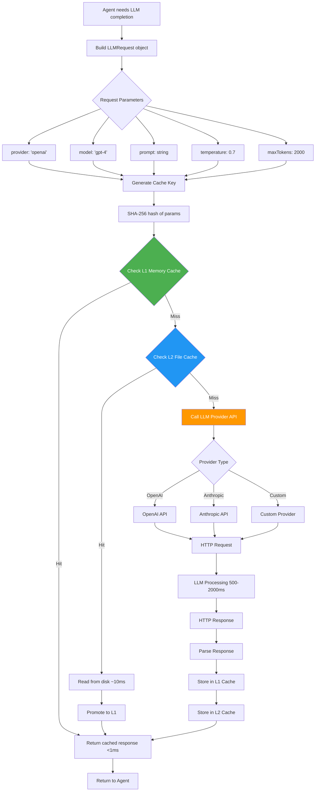
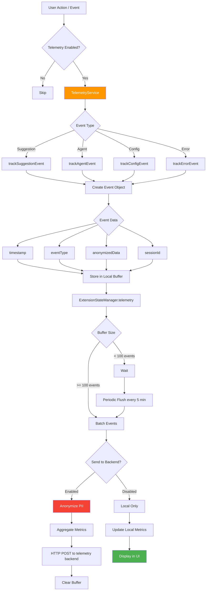
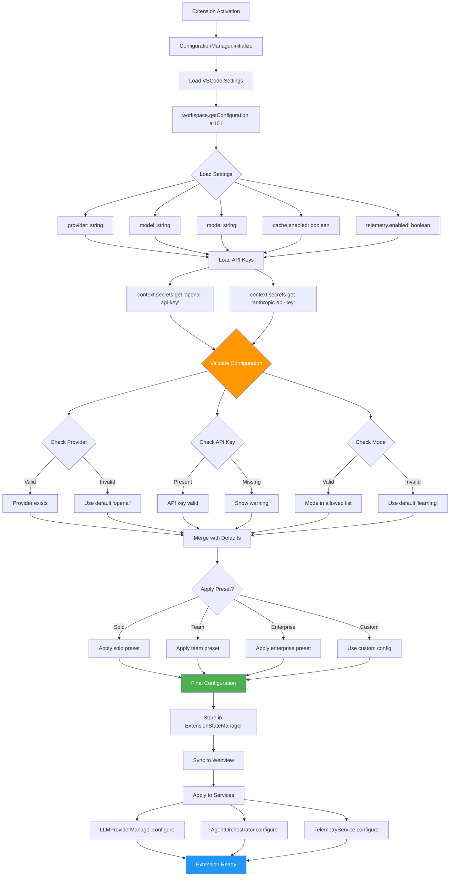
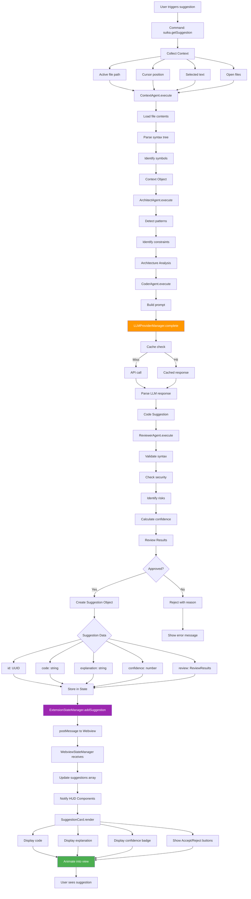
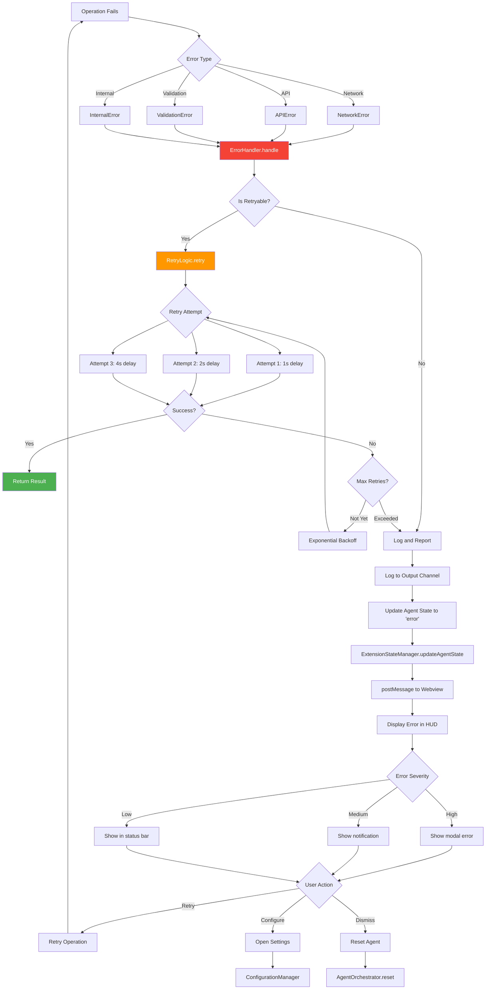

# Data Flow Diagrams

## Key Data Flows

This document illustrates how data flows through the Suika system for critical operations.

## 1. LLM Request → Cache Check → Response Flow

Shows the complete data flow for an LLM request with caching.



## 2. State Update Propagation Flow

Shows how state changes propagate from backend to frontend UI.

```mermaid
flowchart TD
    A[State Change Trigger] --> B{Source}
    B -->|Agent Action| C[AgentOrchestrator]
    B -->|Config Change| D[ConfigurationManager]
    B -->|User Action| E[Command Handler]
    B -->|Telemetry| F[TelemetryService]
    
    C & D & E & F --> G[ExtensionStateManager]
    
    G --> H[Update Backend State]
    H --> I{State Type}
    
    I -->|Agent State| J[state.agents[id] = newState]
    I -->|Config| K[state.config = newConfig]
    I -->|Suggestion| L[state.suggestions.push]
    I -->|Telemetry| M[state.telemetry = metrics]
    
    J & K & L & M --> N[Prepare postMessage]
    
    N --> O{Message Type}
    O --> P[type: 'agent:stateChanged']
    O --> Q[type: 'config:changed']
    O --> R[type: 'suggestion:generated']
    O --> S[type: 'telemetry:updated']
    
    P & Q & R & S --> T[Add payload + timestamp]
    T --> U[JSON.stringify]
    U --> V[webview.postMessage]
    
    V --> W[Browser Context]
    W --> X[window.addEventListener message]
    X --> Y[WebviewStateManager.onMessage]
    
    Y --> Z{Parse Message Type}
    Z --> AA[Update Frontend State]
    
    AA --> AB{Notify Listeners}
    AB --> AC[HUD Components]
    AB --> AD[Agent Visualizations]
    AB --> AE[Vital Signs Bar]
    AB --> AF[Alert System]
    
    AC & AD & AE & AF --> AG[Re-render UI]
    AG --> AH[GPU-accelerated Animation]
    AH --> AI[Display to User]
    
    style G fill:#9C27B0,color:#fff
    style V fill:#FF5722,color:#fff
    style Y fill:#00BCD4,color:#fff
```

## 3. Telemetry Data Flow (Opt-in)

Shows how telemetry data is collected, aggregated, and optionally sent to backend.



## 4. Configuration Loading and Validation Flow

Shows how configuration is loaded, validated, and applied on extension activation.



## 5. Suggestion Generation and Display Flow

Complete flow from user request to suggestion display in HUD.



## 6. Error Recovery Flow

Shows how errors are detected, logged, and recovered from.



## Data Structures

### LLMRequest
```typescript
{
  provider: 'openai' | 'anthropic' | string,
  model: string,
  prompt: string,
  systemPrompt?: string,
  temperature: number,
  maxTokens: number,
  metadata: {
    agentId: string,
    requestId: string,
    timestamp: number
  }
}
```

### AgentState
```typescript
{
  status: 'idle' | 'active' | 'error',
  lastActivity: number,
  currentTask?: string,
  error?: Error
}
```

### Suggestion
```typescript
{
  id: string,
  code: string,
  explanation: string,
  confidence: number,
  review: ReviewResults,
  timestamp: number,
  status: 'pending' | 'accepted' | 'rejected'
}
```

### TelemetryEvent
```typescript
{
  type: string,
  timestamp: number,
  sessionId: string,
  data: Record<string, any>,
  anonymized: boolean
}
```

## Related Documentation

- [System Overview](./system-overview.md)
- [Sequence Diagrams](./sequence-diagrams.md)
- [Hybrid Cache Strategy](../patterns/hybrid-cache.md)
- [Dual State Pattern](../patterns/dual-state.md)
- [Error Handling](../modules/errors.md)
