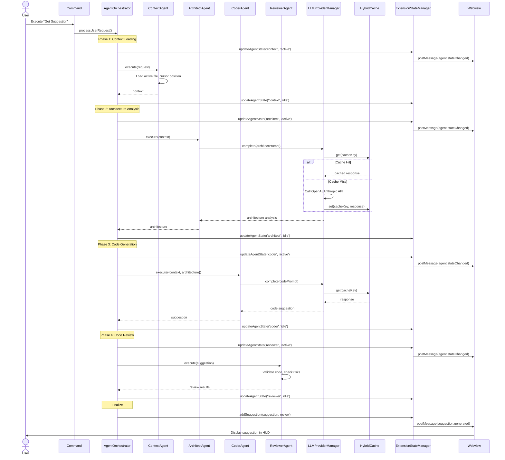
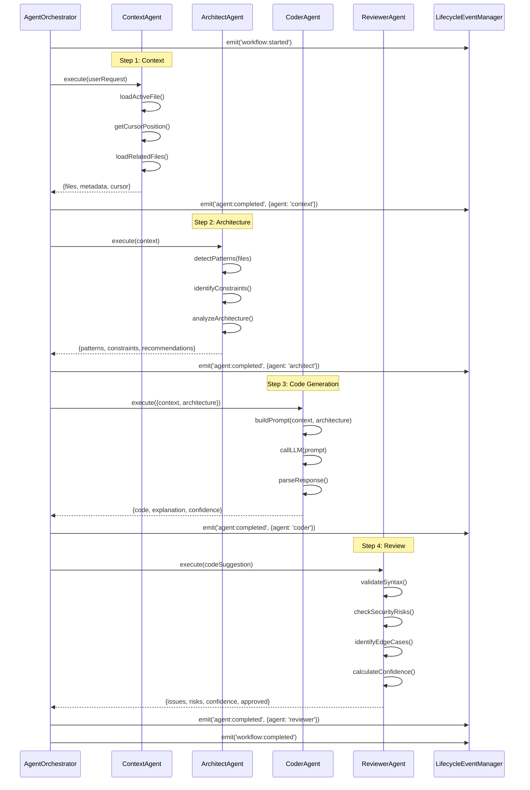
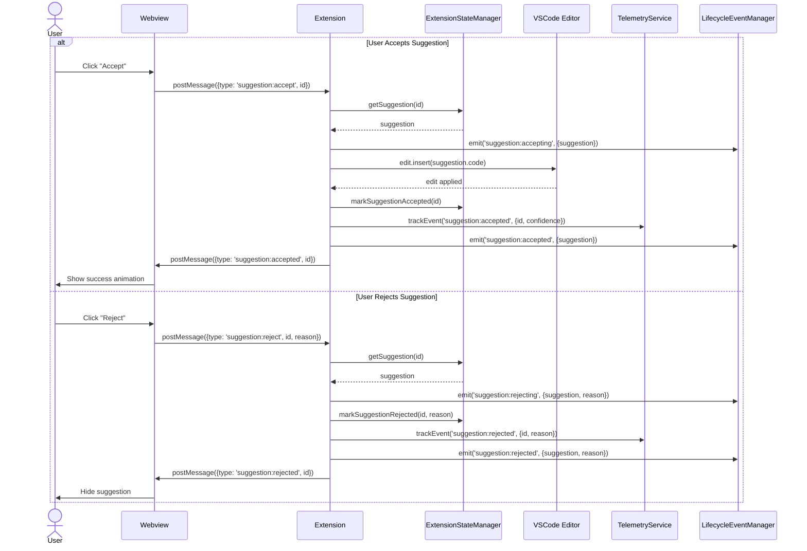
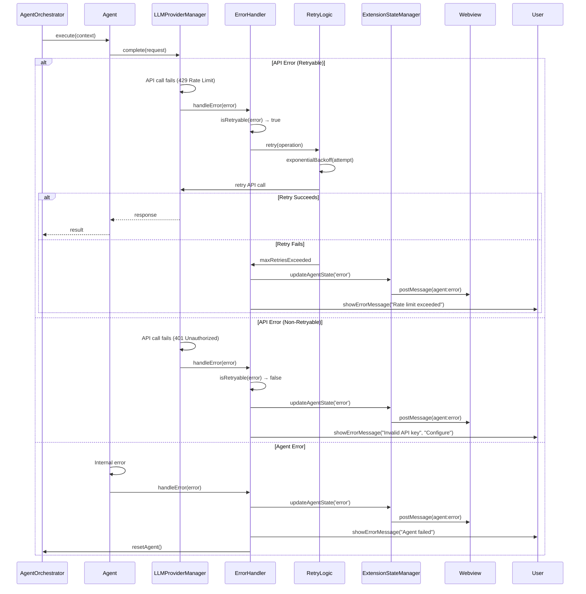
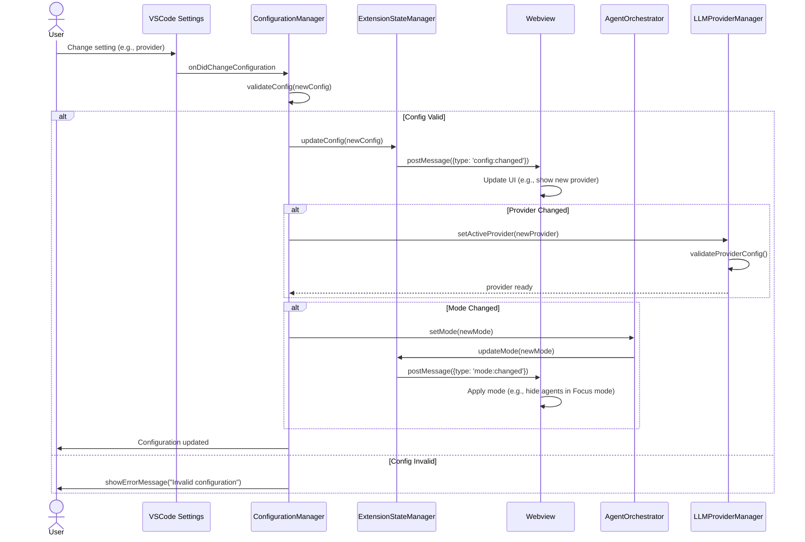
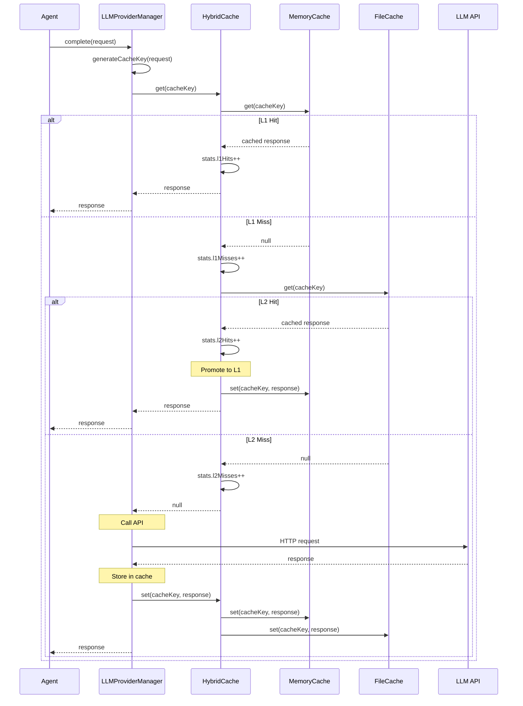
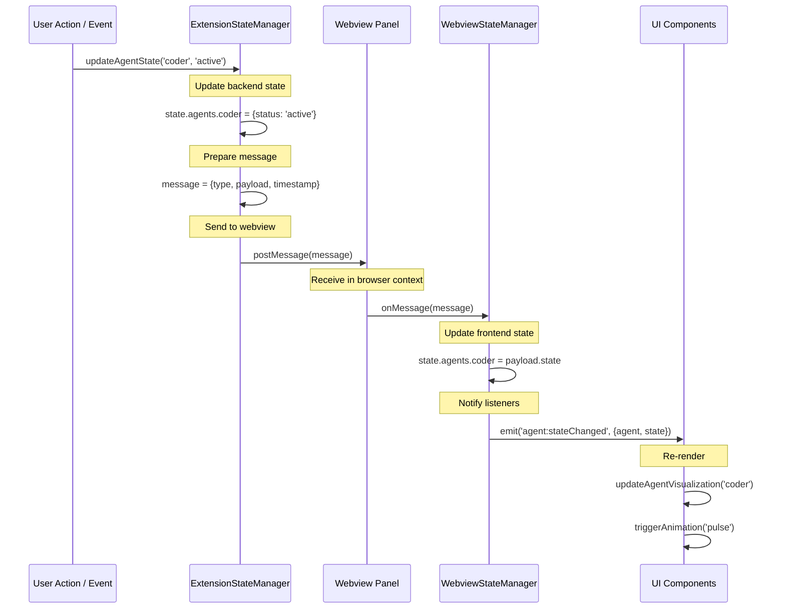

# Sequence Diagrams

## Key Interaction Flows

This document contains sequence diagrams for the most important interaction flows in AI-101.

## 1. User Request Processing Flow

Shows the complete flow from user request to suggestion display.

## 2. Agent Collaboration Sequence

Detailed view of how agents collaborate during code generation.

## 3. Suggestion Accept/Reject Flow

Shows what happens when user accepts or rejects a suggestion.

## 4. Error Handling Flow

Shows how errors are caught, handled, and communicated to the user.

## 5. Configuration Change Flow

Shows how configuration changes propagate through the system.

## 6. Cache Lookup Flow

Detailed view of the hybrid cache lookup process.

## 7. State Synchronization Flow

Shows how state updates flow from backend to frontend.

## Related Documentation

- [System Overview](./system-overview.md)
- [Data Flow Diagrams](./data-flow.md)
- [Orchestrator Central Pattern](../patterns/orchestrator-central.md)
- [Dual State Pattern](../patterns/dual-state.md)
- [Hybrid Cache Strategy](../patterns/hybrid-cache.md)
