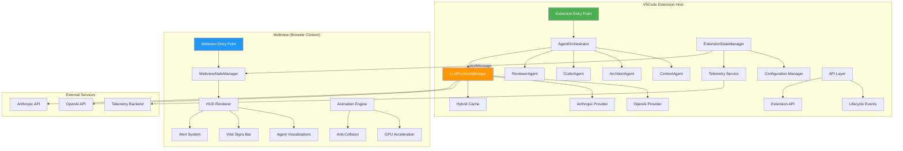
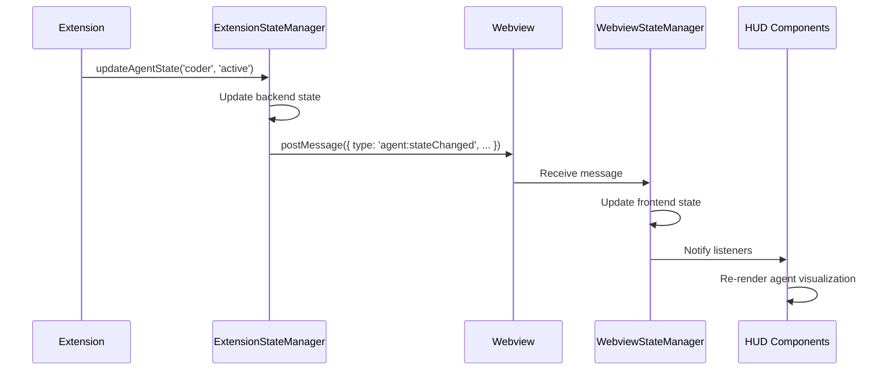
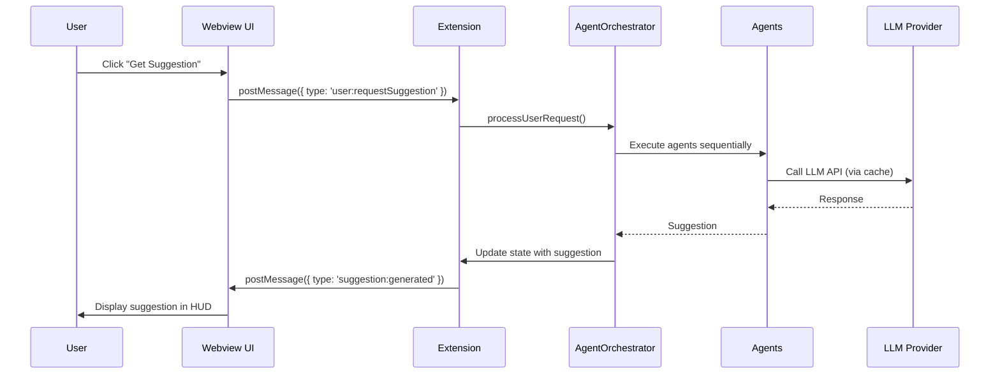
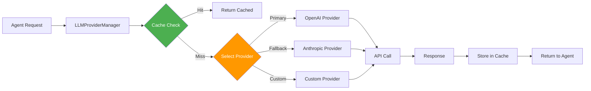
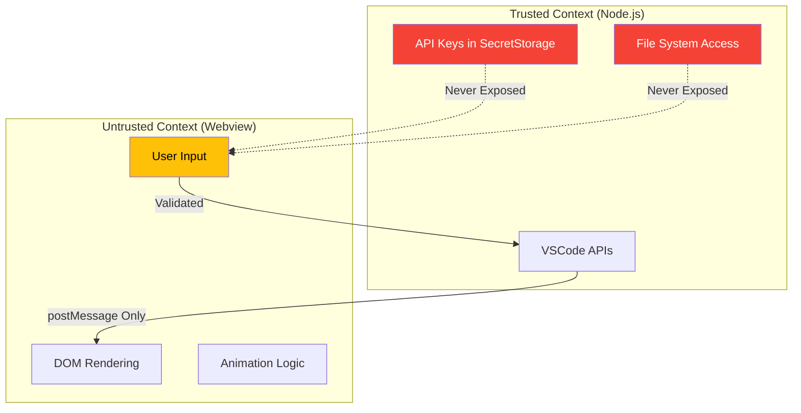
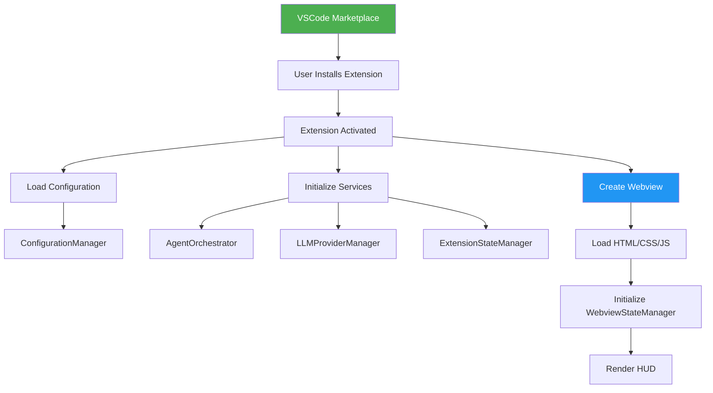

# System Overview

## High-Level Architecture

Suika is a VSCode extension that provides AI-powered coding assistance through a transparent HUD overlay. The system consists of three main layers:

1. **VSCode Extension Layer** (Node.js context)
2. **Webview UI Layer** (Browser context)
3. **External Services Layer** (LLM APIs)

## Component Responsibilities

### Extension Layer Components

#### AgentOrchestrator
- **Purpose**: Coordinate all AI agent interactions
- **Key Responsibilities**:
  - Sequential agent execution (Context → Architect → Coder → Reviewer)
  - State management during agent workflows
  - Error handling and recovery
  - Lifecycle event emission

#### ExtensionStateManager
- **Purpose**: Backend source of truth for all application state
- **Key Responsibilities**:
  - Maintain agent states
  - Store configuration
  - Track suggestions and telemetry
  - Sync state to webview via postMessage

#### LLMProviderManager
- **Purpose**: Abstract LLM provider interactions
- **Key Responsibilities**:
  - Provider registration and selection
  - Request routing with fallbacks
  - Cache integration
  - Rate limiting and cost tracking

#### Configuration Manager
- **Purpose**: Manage extension settings
- **Key Responsibilities**:
  - VSCode settings integration
  - Secure API key storage (SecretStorage)
  - Configuration presets (Solo/Team/Enterprise)
  - Export/import functionality

#### API Layer
- **Purpose**: Public extension API for other extensions
- **Key Responsibilities**:
  - ILLMProvider registration
  - IAgentRenderer registration
  - Lifecycle event subscriptions
  - Configuration API

### Webview Layer Components

#### WebviewStateManager
- **Purpose**: Frontend synchronized copy of backend state
- **Key Responsibilities**:
  - Receive state updates via postMessage
  - Notify UI components of changes
  - Maintain UI-specific state (scroll, hover, animations)

#### HUD Renderer
- **Purpose**: Render transparent overlay UI
- **Key Responsibilities**:
  - Agent visualizations (Sumi-e aesthetic)
  - Vital signs bar (metrics display)
  - Alert system (4-level severity)
  - Suggestion display

#### Animation Engine
- **Purpose**: 60fps GPU-accelerated animations
- **Key Responsibilities**:
  - CSS transform animations
  - Spatial anti-collision algorithm
  - Adaptive agent positioning
  - Non-blocking async rendering

### External Services

#### LLM APIs
- **OpenAI**: GPT-4, GPT-3.5-turbo
- **Anthropic**: Claude 3 (Opus, Sonnet, Haiku)
- **Extensible**: Custom providers via ILLMProvider

#### Telemetry Backend (Optional)
- **Purpose**: Aggregate usage metrics (opt-in)
- **Data**: Anonymized usage patterns, suggestion acceptance rates

## Communication Flows

### VSCode Extension ↔ Webview Communication

### User Interaction Flow

## LLM Provider Integration

## Data Flow Layers

### Layer 1: User Input
- **Source**: VSCode editor, command palette, HUD interactions
- **Flow**: User → Webview → Extension → AgentOrchestrator

### Layer 2: Agent Processing
- **Source**: AgentOrchestrator
- **Flow**: Context → Architect → Coder → Reviewer
- **State Updates**: Each agent updates ExtensionStateManager

### Layer 3: LLM Interaction
- **Source**: Agents (via LLMProviderManager)
- **Flow**: Agent → Cache Check → Provider → API → Response
- **Caching**: L1 Memory + L2 File System

### Layer 4: State Synchronization
- **Source**: ExtensionStateManager
- **Flow**: Backend State → postMessage → WebviewStateManager → UI

### Layer 5: UI Rendering
- **Source**: WebviewStateManager
- **Flow**: State Change → Component Update → GPU Animation → Display

## Security Boundaries

### Security Principles

1. **API Keys**: Stored in VSCode SecretStorage, never sent to webview
2. **File Access**: Extension context only, webview cannot access filesystem
3. **Input Validation**: All webview messages validated before processing
4. **Sandboxing**: Webview runs in sandboxed iframe with limited capabilities

## Deployment Architecture

## Performance Characteristics

| Component | Target Latency | Notes |
|-----------|---------------|-------|
| State Sync (postMessage) | <16ms | Sub-frame for 60fps |
| L1 Cache Hit | <1ms | In-memory access |
| L2 Cache Hit | <10ms | Disk I/O |
| LLM API Call | 500-2000ms | Network + processing |
| UI Animation Frame | 16.67ms | 60fps target |
| Agent State Update | <50ms | Including UI sync |

## Scalability Considerations

### Horizontal Scaling
- **Not Applicable**: Single-user desktop extension
- **Multi-User**: Each user runs own instance

### Vertical Scaling
- **Memory**: ~50-100MB typical, configurable cache sizes
- **CPU**: Minimal (UI animations use GPU)
- **Disk**: Cache directory (~10-100MB depending on usage)

## Related Documentation

- [Orchestrator Central Pattern](../patterns/orchestrator-central.md)
- [Dual State Pattern](../patterns/dual-state.md)
- [Hybrid Cache Strategy](../patterns/hybrid-cache.md)
- [Component Diagram](./component-diagram.md)
- [Sequence Diagrams](./sequence-diagrams.md)
- [Data Flow Diagrams](./data-flow.md)
