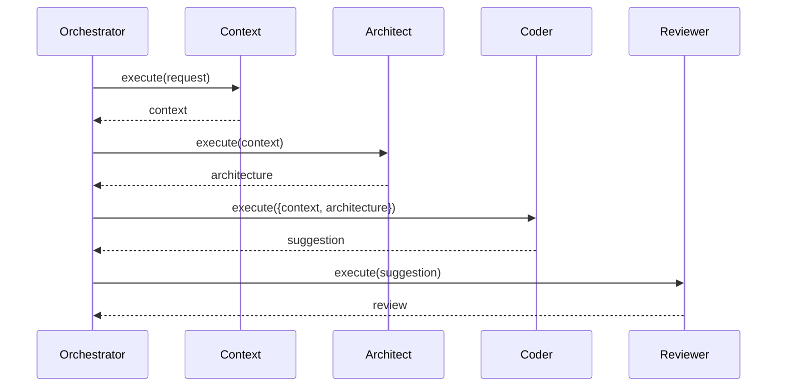

# Agents Module

## Overview

The **Agents Module** (`src/agents/`) implements the four AI agents that collaborate to provide coding assistance: Context, Architect, Coder, and Reviewer.

## Module Structure

```
src/agents/
├── orchestrator.ts          # Central coordination
├── agent.interface.ts       # IAgent interface
├── context/
│   ├── context-agent.ts
│   └── __tests__/
├── architect/
│   ├── architect-agent.ts
│   └── __tests__/
├── coder/
│   ├── coder-agent.ts
│   └── __tests__/
└── reviewer/
    ├── reviewer-agent.ts
    └── __tests__/
```

## IAgent Interface

All agents implement the `IAgent` interface:

```typescript
export interface IAgent {
  id: string;
  execute(context: AgentContext): Promise<AgentResult>;
  getState(): AgentState;
}
```

## Agent Responsibilities

### AgentOrchestrator

**Purpose**: Coordinate all agent interactions in a deterministic sequence.

**Key Methods**:
- `processUserRequest(request: UserRequest): Promise<void>`
- `updateAgentState(agentId: string, state: AgentState): void`
- `handleError(error: Error): void`

**Dependencies**: All agents, ExtensionStateManager, LifecycleEventManager

### ContextAgent

**Purpose**: Load relevant files and project metadata for other agents.

**Responsibilities**:
- Load active file content
- Get cursor position and selection
- Load related files based on imports
- Extract project metadata

**Output**: `{ files: File[], metadata: Metadata, cursor: Position }`

### ArchitectAgent

**Purpose**: Analyze project architecture and identify patterns/constraints.

**Responsibilities**:
- Detect architectural patterns (MVC, MVVM, etc.)
- Identify framework usage (React, Vue, etc.)
- Extract coding conventions
- Determine constraints

**Output**: `{ patterns: Pattern[], constraints: Constraint[], recommendations: string[] }`

### CoderAgent

**Purpose**: Generate code suggestions based on context and architecture.

**Responsibilities**:
- Build LLM prompt from context + architecture
- Call LLM provider via LLMProviderManager
- Parse and format code response
- Add explanations

**Output**: `{ code: string, explanation: string, confidence: number }`

### ReviewerAgent

**Purpose**: Validate generated code for risks and issues.

**Responsibilities**:
- Syntax validation
- Security risk detection
- Edge case identification
- Confidence scoring

**Output**: `{ issues: Issue[], risks: Risk[], confidence: number, approved: boolean }`

## Agent Workflow



## Dependencies

- **LLM Module**: For calling LLM providers (Architect, Coder)
- **State Module**: For updating agent states
- **Events Module**: For emitting lifecycle events
- **Errors Module**: For error handling

## Testing

### Unit Tests

```typescript
describe('CoderAgent', () => {
  it('should generate code suggestion', async () => {
    const mockLLM = createMockLLMProvider();
    const agent = new CoderAgent(mockLLM);
    
    const result = await agent.execute(mockContext);
    
    expect(result.code).toBeDefined();
    expect(result.confidence).toBeGreaterThan(0);
  });
});
```

### Integration Tests

Test agent collaboration through orchestrator with real cache, mocked API.

## Related Documentation

- [Orchestrator Central Pattern](../patterns/orchestrator-central.md)
- [Modules Overview](./overview.md)
- [LLM Module](./llm.md)
