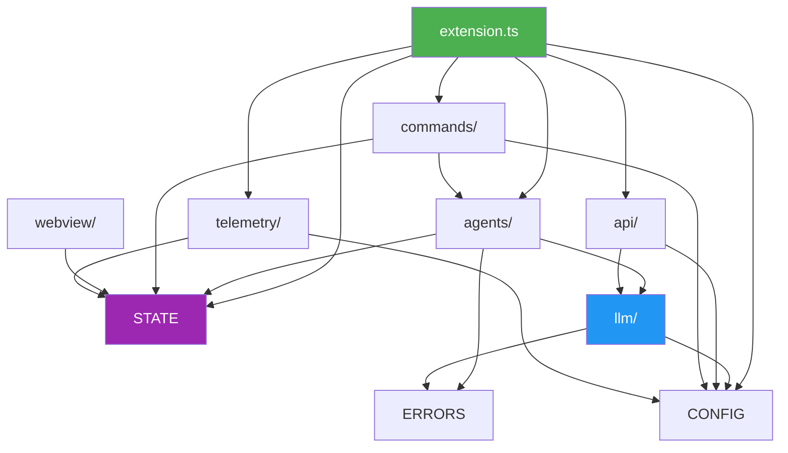

# Modules Overview

## Module Structure

Suika is organized into distinct modules, each with clear responsibilities and boundaries. This document provides a high-level overview of all modules and their relationships.

## Module Directory Structure

```
src/
├── agents/              # AI agent implementations
├── llm/                 # LLM provider abstraction and caching
├── state/               # State management (backend + frontend)
├── api/                 # Public extension API
├── config/              # Configuration management
├── commands/            # VSCode command implementations
├── webview/             # HUD rendering (browser context)
├── ui/                  # UI components
├── telemetry/           # Opt-in usage metrics
├── errors/              # Error handling and retry logic
└── extension.ts         # Extension entry point
```

## Module Dependency Graph



## Module Descriptions

### Core Modules

| Module | Purpose | Key Files | Dependencies |
|--------|---------|-----------|--------------|
| **agents/** | AI agent implementations | orchestrator.ts, agent.interface.ts | llm, state, errors |
| **llm/** | LLM provider abstraction | provider-manager.ts, cache/ | config, errors |
| **state/** | State management | extension-state-manager.ts | None (core) |
| **api/** | Public extension API | extension-api.interface.ts | llm, config |

### Feature Modules

| Module | Purpose | Key Files | Dependencies |
|--------|---------|-----------|--------------|
| **config/** | Configuration management | configuration-manager.ts | VSCode API |
| **commands/** | VSCode commands | command-registry.ts | agents, config, state |
| **webview/** | HUD rendering | main.js, hud-renderer.ts | state (webview only) |
| **telemetry/** | Usage metrics | telemetry-service.ts | config, state |

### Infrastructure Modules

| Module | Purpose | Key Files | Dependencies |
|--------|---------|-----------|--------------|
| **errors/** | Error handling | error-handler.ts, retry-logic.ts | None (core) |
| **ui/** | UI components | components/ | webview |

## Module Dependency Rules

### 1. Layered Architecture

Modules are organized in layers, with dependencies flowing downward only:

```
Layer 4: Application     → extension.ts
Layer 3: Features        → commands/, telemetry/
Layer 2: Domain          → agents/, api/
Layer 1: Infrastructure  → llm/, state/, config/, errors/
```

**Rule**: Higher layers can depend on lower layers, but not vice versa.

### 2. Core Module Independence

**Core Modules** (`state/`, `errors/`) have no dependencies on other application modules.

**Rule**: Core modules must remain dependency-free to ensure reusability and testability.

### 3. No Circular Dependencies

**Rule**: Circular dependencies are strictly prohibited and enforced by TypeScript and ESLint.

Example of **forbidden** circular dependency:
```
agents/ → llm/ → agents/  ❌ NOT ALLOWED
```

### 4. Interface-Based Dependencies

**Rule**: Modules depend on interfaces, not concrete implementations.

Example:
```typescript
// ✅ Good: Depend on interface
import { ILLMProvider } from './llm/provider.interface';

// ❌ Bad: Depend on implementation
import { OpenAIProvider } from './llm/openai/openai-provider';
```

### 5. Webview Isolation

**Rule**: Webview module can only access `WebviewStateManager` from the state module. It cannot import any other extension modules.

**Rationale**: Webview runs in a separate browser context and cannot access Node.js APIs.

## Module Boundaries

### What Each Module Can/Cannot Do

#### agents/
- ✅ **Can**: Execute agent logic, call LLM providers, update state
- ❌ **Cannot**: Access VSCode APIs directly (use via orchestrator), manage configuration

#### llm/
- ✅ **Can**: Call LLM APIs, manage cache, handle provider registration
- ❌ **Cannot**: Update extension state directly, execute agent logic

#### state/
- ✅ **Can**: Store and sync state, emit state change events
- ❌ **Cannot**: Depend on any other module (core module)

#### api/
- ✅ **Can**: Expose public API, register providers, emit lifecycle events
- ❌ **Cannot**: Implement business logic (delegates to other modules)

#### config/
- ✅ **Can**: Load/save settings, validate configuration, manage API keys
- ❌ **Cannot**: Execute agent logic, call LLM APIs directly

#### commands/
- ✅ **Can**: Register VSCode commands, trigger agent workflows
- ❌ **Cannot**: Implement agent logic (delegates to agents module)

#### webview/
- ✅ **Can**: Render UI, handle user interactions, manage animations
- ❌ **Cannot**: Access Node.js APIs, call LLM providers, manage configuration

#### telemetry/
- ✅ **Can**: Collect metrics, send to backend (if enabled)
- ❌ **Cannot**: Modify extension behavior based on metrics

#### errors/
- ✅ **Can**: Handle errors, retry failed operations, log errors
- ❌ **Cannot**: Depend on other modules (core module)

## Module Communication Patterns

### Pattern 1: Direct Method Calls
Used for synchronous, in-process communication within the extension context.

```typescript
// AgentOrchestrator → ContextAgent
const context = await this.contextAgent.execute(request);
```

### Pattern 2: postMessage
Used for communication between extension and webview contexts.

```typescript
// ExtensionStateManager → WebviewStateManager
webview.postMessage({ type: 'agent:stateChanged', payload });
```

### Pattern 3: Event Emission
Used for extensibility and decoupling.

```typescript
// LifecycleEventManager → Extension Subscribers
eventManager.emit('suggestion:generated', { suggestion });
```

### Pattern 4: Dependency Injection
Used for testability and flexibility.

```typescript
// Inject dependencies via constructor
constructor(
  private llmProvider: ILLMProvider,
  private stateManager: ExtensionStateManager
) {}
```

## Testing Strategy by Module

### Unit Testing

| Module | Test Focus | Mocking Strategy |
|--------|-----------|------------------|
| agents/ | Agent logic | Mock ILLMProvider |
| llm/ | Provider calls, caching | Mock HTTP client |
| state/ | State updates, sync | Test in isolation |
| config/ | Validation, presets | Mock VSCode API |
| errors/ | Retry logic | Mock operations |

### Integration Testing

| Module Pair | Test Focus |
|------------|-----------|
| agents/ + llm/ | Agent → LLM flow with real cache |
| state/ + webview/ | postMessage synchronization |
| commands/ + agents/ | Command → Agent execution |

### E2E Testing

- **Full Flow**: User command → Agent → LLM → UI update
- **Framework**: @vscode/test-electron

## Module Evolution Guidelines

### Adding a New Module

1. **Define Purpose**: Clear, single responsibility
2. **Identify Dependencies**: Minimize and document
3. **Create Interface**: Define public API
4. **Update Docs**: Add to this overview
5. **Add Tests**: Unit + integration tests

### Modifying Module Boundaries

1. **Assess Impact**: Check dependent modules
2. **Update Interfaces**: Maintain backward compatibility
3. **Refactor Gradually**: Avoid breaking changes
4. **Update Tests**: Ensure coverage
5. **Document Changes**: Update architecture docs

### Deprecating a Module

1. **Mark as Deprecated**: Add @deprecated JSDoc
2. **Provide Migration Path**: Document alternatives
3. **Maintain for 2 Versions**: Allow time for migration
4. **Remove**: After deprecation period

## Related Documentation

- [Agents Module](./agents.md)
- [LLM Module](./llm.md)
- [State Module](./state.md)
- [Webview Module](./webview.md)
- [API Module](./api.md)
- [Component Diagram](../diagrams/component-diagram.md)
- [Testing Strategy](../testing/strategy.md)
