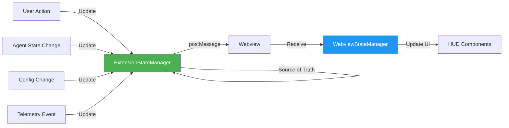

# Dual State Pattern

## Overview

The **Dual State Pattern** maintains two synchronized copies of application state: a backend source of truth in the Node.js extension context, and a frontend synchronized copy in the browser webview context.

## Pattern Description

AI-101 runs in two separate JavaScript contexts:
1. **Backend (Extension)**: Node.js environment with access to VSCode APIs
2. **Frontend (Webview)**: Browser environment with access to DOM and rendering

State must be shared between these contexts while maintaining consistency and performance.

## Architecture Diagram



## Implementation

### Backend: ExtensionStateManager

**Location:** `src/state/extension-state-manager.ts`

```typescript
export class ExtensionStateManager {
  private state: ExtensionState;
  private webviewPanel?: vscode.WebviewPanel;

  constructor() {
    this.state = this.getInitialState();
  }

  /**
   * Update agent state and sync to webview
   */
  updateAgentState(agentId: string, state: AgentState): void {
    // 1. Update backend state (source of truth)
    this.state.agents[agentId] = {
      ...this.state.agents[agentId],
      ...state,
      lastUpdated: Date.now()
    };

    // 2. Sync to webview immediately
    this.syncToWebview('agent:stateChanged', {
      agentId,
      state: this.state.agents[agentId]
    });
  }

  /**
   * Update configuration and sync to webview
   */
  updateConfig(config: Partial<Config>): void {
    this.state.config = { ...this.state.config, ...config };
    this.syncToWebview('config:changed', { config: this.state.config });
  }

  /**
   * Send state update to webview via postMessage
   */
  private syncToWebview(type: string, payload: any): void {
    if (!this.webviewPanel) return;

    this.webviewPanel.webview.postMessage({
      type,
      payload,
      timestamp: Date.now()
    });
  }

  /**
   * Get complete state snapshot (for initial webview load)
   */
  getStateSnapshot(): ExtensionState {
    return JSON.parse(JSON.stringify(this.state));
  }
}
```

### Frontend: WebviewStateManager

**Location:** `src/webview/state/webview-state-manager.ts`

```typescript
export class WebviewStateManager {
  private state: WebviewState;
  private listeners: Map<string, Set<StateListener>>;

  constructor() {
    this.state = {} as WebviewState;
    this.listeners = new Map();
    this.setupMessageListener();
  }

  /**
   * Listen for state updates from extension
   */
  private setupMessageListener(): void {
    window.addEventListener('message', (event) => {
      const message = event.data;

      switch (message.type) {
        case 'agent:stateChanged':
          this.handleAgentStateChange(message.payload);
          break;
        case 'config:changed':
          this.handleConfigChange(message.payload);
          break;
        case 'state:snapshot':
          this.handleStateSnapshot(message.payload);
          break;
      }
    });
  }

  /**
   * Handle agent state change from backend
   */
  private handleAgentStateChange(payload: any): void {
    const { agentId, state } = payload;

    // Update local state
    if (!this.state.agents) this.state.agents = {};
    this.state.agents[agentId] = state;

    // Notify listeners
    this.notifyListeners('agent:stateChanged', { agentId, state });
  }

  /**
   * Subscribe to state changes
   */
  on(event: string, callback: StateListener): () => void {
    if (!this.listeners.has(event)) {
      this.listeners.set(event, new Set());
    }
    this.listeners.get(event)!.add(callback);

    // Return unsubscribe function
    return () => {
      this.listeners.get(event)?.delete(callback);
    };
  }

  /**
   * Get current state (read-only)
   */
  getState(): Readonly<WebviewState> {
    return this.state;
  }
}
```

## Communication Protocol

### postMessage API

Messages flow from extension to webview using VSCode's postMessage API:

```typescript
// Extension → Webview
webview.postMessage({
  type: 'agent:stateChanged',
  payload: { agentId: 'coder', state: { status: 'active' } },
  timestamp: 1234567890
});

// Webview receives
window.addEventListener('message', (event) => {
  const { type, payload, timestamp } = event.data;
  // Handle message
});
```

### Message Types

| Message Type | Direction | Payload | Purpose |
|-------------|-----------|---------|---------|
| `state:snapshot` | Extension → Webview | Full state | Initial load |
| `agent:stateChanged` | Extension → Webview | Agent state | Agent updates |
| `config:changed` | Extension → Webview | Config delta | Config updates |
| `suggestion:generated` | Extension → Webview | Suggestion | New suggestion |
| `telemetry:event` | Extension → Webview | Event data | Telemetry update |
| `user:action` | Webview → Extension | Action data | User interaction |

## State Synchronization

### Synchronization Timing

- **Target**: 0ms throttle (immediate propagation)
- **Actual**: <16ms (sub-frame latency for 60fps)
- **Guarantee**: State updates arrive before next render frame

### Synchronization Guarantees

1. **Eventual Consistency**: Webview state will match backend state
2. **Ordered Delivery**: Messages arrive in send order
3. **No Loss**: postMessage is reliable within same process
4. **Atomic Updates**: Each message represents a complete state change

### Initial State Loading

When webview loads, it requests a full state snapshot:

```typescript
// Webview startup
const vscode = acquireVsCodeApi();

// Request initial state
vscode.postMessage({ type: 'request:stateSnapshot' });

// Extension responds
extensionStateManager.syncToWebview('state:snapshot', {
  state: extensionStateManager.getStateSnapshot()
});
```

## State Structure

### Backend State (ExtensionState)

```typescript
interface ExtensionState {
  agents: Record<string, AgentState>;
  config: Config;
  suggestions: Suggestion[];
  telemetry: TelemetryState;
  cache: CacheMetrics;
  session: SessionInfo;
}
```

### Frontend State (WebviewState)

```typescript
interface WebviewState {
  agents: Record<string, AgentState>;
  config: Config;
  suggestions: Suggestion[];
  ui: UIState; // Frontend-only state
}
```

Note: `ui` state (scroll position, animations, hover states) is frontend-only and not synced.

## Performance Considerations

### Minimizing postMessage Overhead

1. **Delta Updates**: Send only changed fields, not entire state
2. **Batching**: Group multiple updates when possible
3. **Serialization**: Use JSON-serializable data only
4. **Size Limits**: Keep messages <1MB for performance

```typescript
// ❌ Bad: Send entire state
this.syncToWebview('state:update', this.state);

// ✅ Good: Send delta
this.syncToWebview('agent:stateChanged', {
  agentId: 'coder',
  state: { status: 'active' }
});
```

### Avoiding Sync Loops

```typescript
// ❌ Bad: Can cause infinite loop
webview.on('state:changed', (state) => {
  extension.updateState(state); // Triggers sync back to webview
});

// ✅ Good: One-way flow
extension.updateState(newState); // Only extension updates state
webview.on('state:changed', (state) => {
  // Just update UI, don't send back
});
```

## Error Handling

### Serialization Errors

```typescript
private syncToWebview(type: string, payload: any): void {
  try {
    const message = JSON.stringify({ type, payload });
    this.webviewPanel.webview.postMessage(JSON.parse(message));
  } catch (error) {
    console.error('Failed to serialize state update', error);
    // Send error notification instead
    this.webviewPanel.webview.postMessage({
      type: 'error',
      payload: { message: 'State sync failed' }
    });
  }
}
```

### Webview Not Ready

```typescript
private syncToWebview(type: string, payload: any): void {
  if (!this.webviewPanel) {
    // Queue message for when webview loads
    this.messageQueue.push({ type, payload });
    return;
  }

  this.webviewPanel.webview.postMessage({ type, payload });
}
```

## Benefits

### ✅ Advantages
- **Clear Ownership**: Backend is always source of truth
- **Separation**: Business logic in extension, UI logic in webview
- **Debuggability**: Can inspect state in both contexts
- **Resilience**: Webview can reload without losing state
- **Security**: Sensitive data stays in extension context

### ⚠️ Trade-offs
- **Latency**: postMessage adds ~1-5ms overhead
- **Serialization**: Only JSON-serializable data
- **Complexity**: Must maintain two state managers
- **Memory**: State duplicated in both contexts

## When to Use This Pattern

✅ **Use when:**
- Running in VSCode webview architecture
- Need separation between business logic and UI
- State must survive webview reloads
- Security requires backend-only data

❌ **Avoid when:**
- Single JavaScript context (not applicable)
- Real-time state sync (<1ms) required
- State is too large to serialize efficiently

## Related Patterns

- [Orchestrator Central Pattern](./orchestrator-central.md) - How state updates are triggered
- [postMessage Protocol](../communication/postmessage.md) - Detailed message protocol
- [ADR-005](../adr/005-dual-state-pattern.md) - Why this pattern was chosen

## References

- **Backend State**: `src/state/extension-state-manager.ts`
- **Frontend State**: `src/webview/state/webview-state-manager.ts`
- **Message Protocol**: `src/communication/message-protocol.ts`
- **VSCode Webview API**: https://code.visualstudio.com/api/extension-guides/webview
