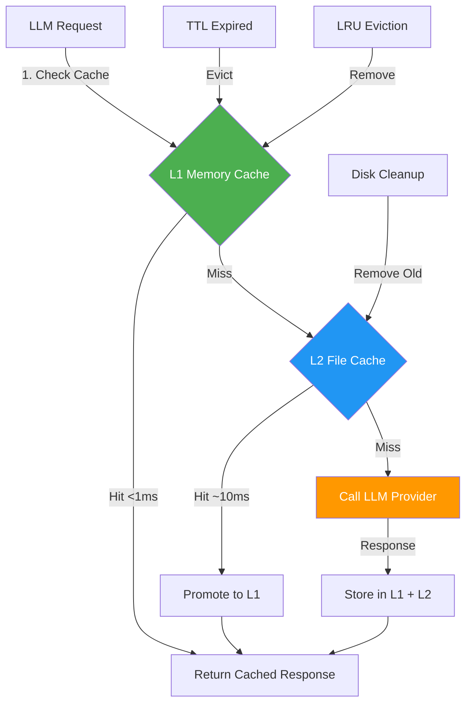

# Hybrid Cache Strategy

## Overview

The **Hybrid Cache Strategy** implements a two-tier caching system for LLM responses: L1 in-memory cache for speed and L2 file system cache for persistence. This optimizes both performance and cost.

## Pattern Description

LLM API calls are expensive in both time and money. The hybrid cache reduces:
- **Latency**: <1ms L1 cache hits vs 500-2000ms API calls
- **Cost**: >50% cache hit rate target saves significant API costs
- **Reliability**: Cached responses available even when API is down

## Architecture Diagram



## Implementation

### L1: In-Memory LRU Cache

**Location:** `src/llm/cache/memory-cache.ts`

```typescript
export class MemoryCache implements ICache {
  private cache: Map<string, CacheEntry>;
  private maxSize: number;
  private ttl: number;

  constructor(config: CacheConfig) {
    this.cache = new Map();
    this.maxSize = config.maxSize || 100;
    this.ttl = config.ttl || 3600000; // 1 hour default
  }

  /**
   * Get cached response (L1)
   * @returns Cached response or null if miss/expired
   */
  async get(key: string): Promise<string | null> {
    const entry = this.cache.get(key);

    if (!entry) {
      return null; // Cache miss
    }

    // Check TTL expiration
    if (Date.now() - entry.timestamp > this.ttl) {
      this.cache.delete(key);
      return null; // Expired
    }

    // LRU: Move to end (most recently used)
    this.cache.delete(key);
    this.cache.set(key, entry);

    return entry.value;
  }

  /**
   * Store response in L1 cache
   */
  async set(key: string, value: string): Promise<void> {
    // Evict oldest if at capacity
    if (this.cache.size >= this.maxSize) {
      const firstKey = this.cache.keys().next().value;
      this.cache.delete(firstKey);
    }

    this.cache.set(key, {
      value,
      timestamp: Date.now(),
      size: value.length
    });
  }

  /**
   * Get cache statistics
   */
  getStats(): CacheStats {
    const entries = Array.from(this.cache.values());
    return {
      size: this.cache.size,
      maxSize: this.maxSize,
      totalBytes: entries.reduce((sum, e) => sum + e.size, 0),
      oldestEntry: Math.min(...entries.map(e => e.timestamp)),
      newestEntry: Math.max(...entries.map(e => e.timestamp))
    };
  }
}
```

### L2: File System Cache

**Location:** `src/llm/cache/file-cache.ts`

```typescript
export class FileCache implements ICache {
  private cacheDir: string;
  private ttl: number;

  constructor(config: CacheConfig) {
    this.cacheDir = config.cacheDir || path.join(os.tmpdir(), 'ai-101-cache');
    this.ttl = config.ttl || 86400000; // 24 hours default
    this.ensureCacheDir();
  }

  /**
   * Get cached response from disk (L2)
   */
  async get(key: string): Promise<string | null> {
    const filePath = this.getFilePath(key);

    try {
      const stats = await fs.stat(filePath);

      // Check TTL expiration
      if (Date.now() - stats.mtimeMs > this.ttl) {
        await fs.unlink(filePath);
        return null; // Expired
      }

      const content = await fs.readFile(filePath, 'utf-8');
      return content;
    } catch (error) {
      return null; // File not found or read error
    }
  }

  /**
   * Store response on disk (L2)
   */
  async set(key: string, value: string): Promise<void> {
    const filePath = this.getFilePath(key);
    await fs.writeFile(filePath, value, 'utf-8');
  }

  /**
   * Generate file path from cache key
   */
  private getFilePath(key: string): string {
    const hash = crypto.createHash('sha256').update(key).digest('hex');
    return path.join(this.cacheDir, `${hash}.json`);
  }

  /**
   * Clean up expired cache files
   */
  async cleanup(): Promise<number> {
    const files = await fs.readdir(this.cacheDir);
    let removed = 0;

    for (const file of files) {
      const filePath = path.join(this.cacheDir, file);
      const stats = await fs.stat(filePath);

      if (Date.now() - stats.mtimeMs > this.ttl) {
        await fs.unlink(filePath);
        removed++;
      }
    }

    return removed;
  }
}
```

### Hybrid Cache Coordinator

**Location:** `src/llm/cache/hybrid-cache.ts`

```typescript
export class HybridCache implements ICache {
  private l1: MemoryCache;
  private l2: FileCache;
  private stats: HybridCacheStats;

  constructor(config: CacheConfig) {
    this.l1 = new MemoryCache({
      maxSize: config.l1MaxSize || 100,
      ttl: config.l1Ttl || 3600000 // 1 hour
    });

    this.l2 = new FileCache({
      cacheDir: config.cacheDir,
      ttl: config.l2Ttl || 86400000 // 24 hours
    });

    this.stats = this.initStats();
  }

  /**
   * Get from L1, fallback to L2, promote on L2 hit
   */
  async get(key: string): Promise<string | null> {
    // Try L1 first (fast)
    const l1Result = await this.l1.get(key);
    if (l1Result) {
      this.stats.l1Hits++;
      return l1Result;
    }

    this.stats.l1Misses++;

    // Try L2 (slower but persistent)
    const l2Result = await this.l2.get(key);
    if (l2Result) {
      this.stats.l2Hits++;

      // Promote to L1 for future fast access
      await this.l1.set(key, l2Result);

      return l2Result;
    }

    this.stats.l2Misses++;
    return null; // Complete cache miss
  }

  /**
   * Store in both L1 and L2
   */
  async set(key: string, value: string): Promise<void> {
    await Promise.all([
      this.l1.set(key, value),
      this.l2.set(key, value)
    ]);
  }

  /**
   * Get cache hit rate and statistics
   */
  getStats(): HybridCacheStats {
    const totalRequests = this.stats.l1Hits + this.stats.l1Misses;
    const totalHits = this.stats.l1Hits + this.stats.l2Hits;

    return {
      ...this.stats,
      hitRate: totalRequests > 0 ? totalHits / totalRequests : 0,
      l1HitRate: totalRequests > 0 ? this.stats.l1Hits / totalRequests : 0,
      l2HitRate: this.stats.l1Misses > 0 
        ? this.stats.l2Hits / this.stats.l1Misses 
        : 0
    };
  }
}
```

## Cache Key Generation

Cache keys are generated from request parameters to ensure uniqueness:

```typescript
function generateCacheKey(request: LLMRequest): string {
  const components = [
    request.provider,           // 'openai' | 'anthropic'
    request.model,              // 'gpt-4' | 'claude-3'
    request.prompt,             // User prompt
    request.temperature,        // Sampling temperature
    request.maxTokens,          // Max response tokens
    JSON.stringify(request.systemPrompt || '')
  ];

  const keyString = components.join('::');
  return crypto.createHash('sha256').update(keyString).digest('hex');
}
```

## Cache Invalidation

### TTL-Based Expiration

- **L1 TTL**: 1 hour (configurable)
- **L2 TTL**: 24 hours (configurable)
- **Rationale**: Balance freshness vs cost savings

### Manual Invalidation

```typescript
// Invalidate specific key
await cache.delete(key);

// Clear all cache
await cache.clear();

// Clear by pattern
await cache.clearByPattern('openai::gpt-4::*');
```

### Automatic Cleanup

```typescript
// Run cleanup every 6 hours
setInterval(async () => {
  const removed = await fileCache.cleanup();
  console.log(`Cleaned up ${removed} expired cache files`);
}, 6 * 60 * 60 * 1000);
```

## Eviction Policies

### L1: LRU (Least Recently Used)

When L1 reaches `maxSize`, evict the oldest accessed entry:

```typescript
if (this.cache.size >= this.maxSize) {
  const firstKey = this.cache.keys().next().value; // Oldest
  this.cache.delete(firstKey);
}
```

### L2: TTL-Based

L2 files are removed when:
1. Accessed and found expired
2. Periodic cleanup job runs
3. Manual cache clear

## Performance Metrics

### Target Metrics

| Metric | Target | Rationale |
|--------|--------|-----------|
| L1 Hit Rate | >30% | Frequent repeated requests |
| L2 Hit Rate | >20% | Session continuity |
| Overall Hit Rate | >50% | Cost optimization (NFR) |
| L1 Latency | <1ms | In-memory access |
| L2 Latency | <10ms | Disk I/O |
| API Latency | 500-2000ms | Network + LLM processing |

### Monitoring

```typescript
const stats = cache.getStats();

console.log(`Cache Hit Rate: ${(stats.hitRate * 100).toFixed(1)}%`);
console.log(`L1 Hits: ${stats.l1Hits}, L2 Hits: ${stats.l2Hits}`);
console.log(`Total Misses: ${stats.l1Misses + stats.l2Misses}`);

// Alert if hit rate drops below target
if (stats.hitRate < 0.5) {
  console.warn('Cache hit rate below 50% target');
}
```

## Integration with LLMProviderManager

**Location:** `src/llm/provider-manager.ts`

```typescript
export class LLMProviderManager {
  private cache: HybridCache;
  private providers: Map<string, ILLMProvider>;

  async complete(request: LLMRequest): Promise<LLMResponse> {
    // 1. Generate cache key
    const cacheKey = generateCacheKey(request);

    // 2. Check cache
    const cached = await this.cache.get(cacheKey);
    if (cached) {
      return JSON.parse(cached);
    }

    // 3. Cache miss - call provider
    const provider = this.providers.get(request.provider);
    const response = await provider.complete(request);

    // 4. Store in cache
    await this.cache.set(cacheKey, JSON.stringify(response));

    return response;
  }
}
```

## Configuration

### Cache Configuration Options

```typescript
interface CacheConfig {
  // L1 Memory Cache
  l1MaxSize?: number;        // Default: 100 entries
  l1Ttl?: number;            // Default: 1 hour (3600000ms)

  // L2 File Cache
  cacheDir?: string;         // Default: OS temp dir
  l2Ttl?: number;            // Default: 24 hours (86400000ms)

  // Cleanup
  cleanupInterval?: number;  // Default: 6 hours
}
```

### User Configuration

Exposed in VSCode settings:

```json
{
  "suika.cache.enabled": true,
  "suika.cache.l1MaxSize": 100,
  "suika.cache.l1TtlHours": 1,
  "suika.cache.l2TtlHours": 24,
  "suika.cache.directory": "~/.ai-101/cache"
}
```

## Benefits

### ✅ Advantages
- **Performance**: <1ms L1 hits vs 500-2000ms API calls
- **Cost Savings**: >50% hit rate reduces API costs significantly
- **Offline Support**: L2 cache works without network
- **Reliability**: Cached responses available during API outages
- **Persistence**: L2 survives extension reloads

### ⚠️ Trade-offs
- **Staleness**: Cached responses may be outdated
- **Disk Space**: L2 cache consumes disk storage
- **Memory**: L1 cache uses heap memory
- **Complexity**: Two-tier system more complex than single cache

## When to Use This Pattern

✅ **Use when:**
- API calls are expensive (time or cost)
- Responses are deterministic or semi-deterministic
- Same requests occur frequently
- Offline support is valuable

❌ **Avoid when:**
- Responses must always be fresh
- Requests are always unique
- Memory/disk constraints are severe
- Determinism is not guaranteed

## Related Patterns

- [LLM Provider Integration](../modules/llm.md) - How cache integrates with providers
- [ADR-004](../adr/004-hybrid-cache-strategy.md) - Why hybrid cache was chosen

## References

- **Memory Cache**: `src/llm/cache/memory-cache.ts`
- **File Cache**: `src/llm/cache/file-cache.ts`
- **Hybrid Cache**: `src/llm/cache/hybrid-cache.ts`
- **Provider Manager**: `src/llm/provider-manager.ts`
- **Cache Interface**: `src/llm/cache/cache.interface.ts`
