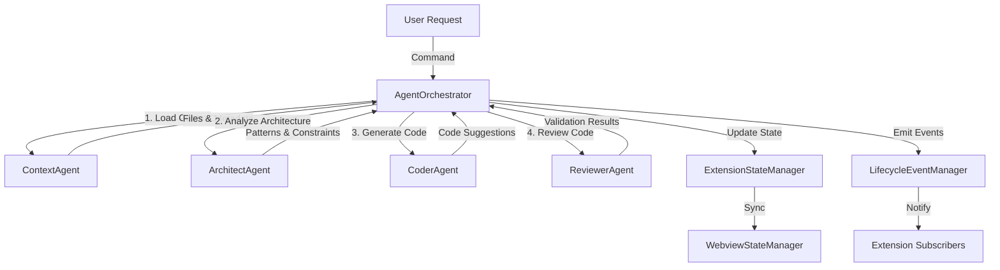

# Orchestrator Central Pattern

## Overview

The **Orchestrator Central Pattern** is the core coordination mechanism in Suika. A single `AgentOrchestrator` class manages all agent interactions, ensuring deterministic execution order and centralized state management.

## Pattern Description

Instead of using an event bus or pub/sub system, Suika uses direct method calls through a central orchestrator. This provides:

- **Predictable execution order**: Context → Architect → Coder → Reviewer
- **Centralized error handling**: Single point for catching and managing failures
- **Clear state transitions**: Explicit state updates via `ExtensionStateManager`
- **Lifecycle event emission**: Consistent event publishing via `LifecycleEventManager`

## Architecture Diagram



## Implementation

### AgentOrchestrator Class

**Location:** `src/agents/orchestrator.ts`

```typescript
export class AgentOrchestrator {
  private contextAgent: IAgent;
  private architectAgent: IAgent;
  private coderAgent: IAgent;
  private reviewerAgent: IAgent;
  private stateManager: ExtensionStateManager;
  private eventManager: LifecycleEventManager;

  async processUserRequest(request: UserRequest): Promise<void> {
    try {
      // Phase 1: Context Loading
      this.updateAgentState('context', 'active');
      const context = await this.contextAgent.execute(request);
      this.updateAgentState('context', 'idle');

      // Phase 2: Architecture Analysis
      this.updateAgentState('architect', 'active');
      const architecture = await this.architectAgent.execute(context);
      this.updateAgentState('architect', 'idle');

      // Phase 3: Code Generation
      this.updateAgentState('coder', 'active');
      const code = await this.coderAgent.execute({ context, architecture });
      this.updateAgentState('coder', 'idle');

      // Phase 4: Code Review
      this.updateAgentState('reviewer', 'active');
      const review = await this.reviewerAgent.execute(code);
      this.updateAgentState('reviewer', 'idle');

      // Emit lifecycle event
      this.eventManager.emit('suggestion:generated', { code, review });
    } catch (error) {
      this.handleError(error);
    }
  }

  private updateAgentState(agent: string, state: AgentState): void {
    this.stateManager.updateAgentState(agent, state);
    this.eventManager.emit('agent:stateChanged', { agent, state });
  }
}
```

## Agent Coordination Flow

### 1. Context Agent
- **Responsibility**: Load relevant files and project metadata
- **Input**: User request, active file, cursor position
- **Output**: Contextual information for other agents
- **State**: `idle` → `active` → `idle`

### 2. Architect Agent
- **Responsibility**: Analyze project architecture and patterns
- **Input**: Context from ContextAgent
- **Output**: Architecture constraints and patterns
- **State**: `idle` → `active` → `idle`

### 3. Coder Agent
- **Responsibility**: Generate code suggestions
- **Input**: Context + Architecture analysis
- **Output**: Code suggestions with explanations
- **State**: `idle` → `active` → `idle`

### 4. Reviewer Agent
- **Responsibility**: Validate code for risks and issues
- **Input**: Generated code suggestions
- **Output**: Validation results, warnings, errors
- **State**: `idle` → `active` → `idle`

## State Management During Orchestration

The orchestrator updates agent states through `ExtensionStateManager`:

```typescript
interface AgentState {
  status: 'idle' | 'active' | 'error';
  lastActivity?: number;
  currentTask?: string;
}
```

State updates trigger:
1. **Backend state change** in `ExtensionStateManager`
2. **postMessage to webview** for UI synchronization
3. **Lifecycle event emission** for extension subscribers

## Event Emission via LifecycleEventManager

The orchestrator emits events at key points:

```typescript
// Agent lifecycle events
eventManager.emit('agent:stateChanged', { agent: 'coder', state: 'active' });
eventManager.emit('agent:error', { agent: 'reviewer', error });

// Suggestion lifecycle events
eventManager.emit('suggestion:generated', { suggestion });
eventManager.emit('suggestion:accepted', { suggestion });
eventManager.emit('suggestion:rejected', { suggestion });
```

Extensions can subscribe to these events via the public API:

```typescript
const api = vscode.extensions.getExtension('ai-101').exports;
api.on('agent:stateChanged', (event) => {
  console.log(`Agent ${event.agent} is now ${event.state}`);
});
```

## Error Handling

Centralized error handling in the orchestrator:

```typescript
private handleError(error: Error): void {
  // 1. Log error
  this.logger.error('Orchestration failed', error);

  // 2. Update agent state to error
  this.stateManager.updateAgentState(this.currentAgent, 'error');

  // 3. Emit error event
  this.eventManager.emit('agent:error', { 
    agent: this.currentAgent, 
    error 
  });

  // 4. Show user-friendly message
  vscode.window.showErrorMessage(
    `Suika: ${error.message}`,
    'View Logs'
  );

  // 5. Reset to idle state
  this.resetAllAgents();
}
```

## Benefits

### ✅ Advantages
- **Predictable**: Deterministic execution order
- **Debuggable**: Single entry point for breakpoints
- **Testable**: Easy to mock and test coordination logic
- **Maintainable**: Clear responsibilities and flow
- **Observable**: Centralized event emission

### ⚠️ Trade-offs
- **Coupling**: Orchestrator knows about all agents
- **Scalability**: Adding agents requires orchestrator changes
- **Flexibility**: Less flexible than event-driven architecture

## When to Use This Pattern

✅ **Use when:**
- Execution order matters (sequential agent workflow)
- Centralized error handling is needed
- State transitions must be explicit
- Debugging and testing are priorities

❌ **Avoid when:**
- Agents need to run independently
- Dynamic agent addition/removal is required
- Loose coupling is more important than predictability

## Related Patterns

- [Dual State Pattern](./dual-state.md) - How state is managed and synchronized
- [Event System](../communication/events.md) - How lifecycle events work
- [ADR-001](../adr/001-orchestrator-central-pattern.md) - Why this pattern was chosen

## References

- **Implementation**: `src/agents/orchestrator.ts`
- **Agent Interface**: `src/agents/agent.interface.ts`
- **State Manager**: `src/state/extension-state-manager.ts`
- **Event Manager**: `src/api/lifecycle-event-manager.ts`
